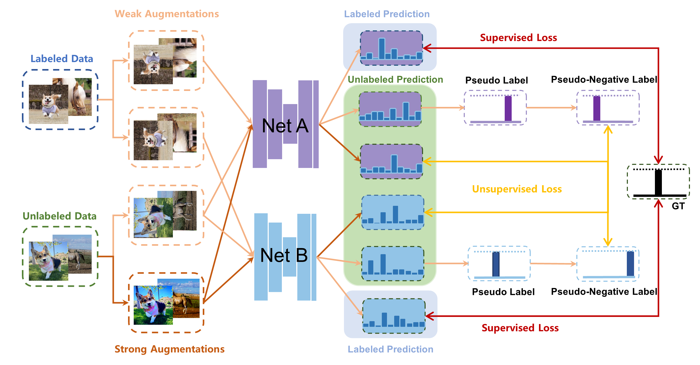

# Semi-Supervised Learning with Pseudo-Negative Labels for Image Classification


This is the PyTorch implementation for this paper [Semi-Supervised Learning with Pseudo-Negative Labels for Image Classification](https://arxiv.org/abs/2301.03976). 
The style of code follows the official implementation of [Dual Student](https://arxiv.org/abs/1909.01804) and [Mean Teacher](https://github.com/CuriousAI/mean-teacher) (Code from their repository is inside the folder `./third_party/mean_teacher`). 

> **Abstract.** Semi-supervised learning frameworks usually adopt mutual learning approaches with multiple submodels to learn from different perspectives. To avoid transferring erroneous pseudo labels between these submodels, a high threshold is usually used to filter out a large number of low-confidence predictions for unlabeled data. However, such filtering can not fully exploit unlabeled data with low prediction confidence. To overcome this problem, in this work, we propose a mutual learning framework based on pseudo-negative labels. Negative labels are those that a corresponding data item does not belong. In each iteration, one submodel generates pseudo-negative labels for each data item, and the other submodel learns from these labels. The role of the two submodels exchanges after each iteration until convergence. By reducing the prediction probability on pseudo-negative labels, the dual model can improve its prediction ability. We also propose a mechanism to select a few pseudo-negative labels to feed into submodels. In the experiments, our framework achieves state-of-the-art results on several main benchmarks. Specifically, with our framework, the error rates of the 13-layer CNN model are 9.35% and 7.94% for CIFAR-10 with 1000 and 4000 labels, respectively. In addition, for the non-augmented MNIST with only 20 labels, the error rate is 0.81% by our framework, which is much smaller than that of other approaches. Our approach also demonstrates a significant performance improvement in domain adaptation.




## Preparation
This code runs on Python 3 with PyTorch 1.10.0. If you use Anaconda 3:
1. Create a new python environment and switch to it:
    ```
    conda create -n ssl_dnll python=3.7
    source activate ssl_dnll
    ```

2. Install PyTorch 1.10.0:
    ```
    conda install pytorch==1.10.0 torchvision==0.11.0 torchaudio==0.10.0 -c pytorch
    ```

3. Install other dependencies:
    ```
    pip install numpy scipy pandas tqdm matplotlib
    ```

4. Clone this repository by:
    ```
    git clone https://github.com/60972823l/SSL-DNLL.git
    ```


## Experiments
### Semi-Supervised Learning with Dual Student
Running on the CIFAR benchmark with 1 GPU:

Switch to the project folder `./SSL-DNLL` and prepare the CIFAR-10 dataset by following commands:
```
./third_party/data-local/bin/prepare_cifar10.sh
```

#### For example, for CIFAR-10 with combination of dual student and dnll:
```
python3 scripts.dd_cifar10_1000l_cnn13
```

#### For example, for CIFAR-10 with combination of mean teacher and dnll:
```
python3 scripts.md_cifar10_1000l_cnn13
```


## Citation
```bibtex
@article{xu2023semi,
  title={Semi-supervised learning with pseudo-negative labels for image classification},
  author={Xu, Hao and Xiao, Hui and Hao, Huazheng and Dong, Li and Qiu, Xiaojie and Peng, Chengbin},
  journal={Knowledge-Based Systems},
  volume={260},
  pages={110166},
  year={2023},
  publisher={Elsevier}
}
```

